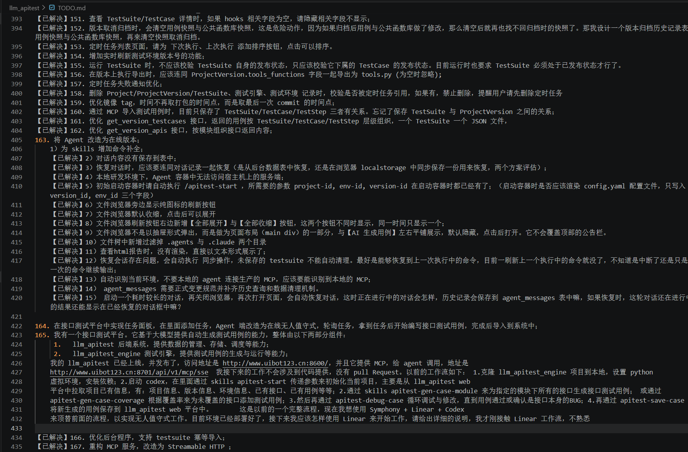

# 拾种 Workseed

拾种（Workseed）是一款面向个人的轻量记录工具，用来快速捕捉突然出现的待办事项或灵感，避免它们在片刻之后被遗忘。

Workseed 只专注于个人使用，不提供多人协作、权限管理、任务指派、进度跟踪等团队能力。团队协作或完整的项目管理并不属于本工具的适用范围，请选择专业的项目管理工具。

项目采用 Go + Vue 3 + TypeScript + Vite + SQLite。前端构建产物会嵌入 Go 二进制，部署时只需要一个可执行文件和一个数据目录，直接双击运行。

项目全由 CodeX 完成。

## 功能

- 创建和切换项目，也可不选项目跨项目查看种子；自动记住上次选择，项目名称全局唯一（忽略大小写）
- 从设置面板归档或恢复项目、删除空项目，并配置每天的上下班时间
- 新增、编辑、查看和删除种子
- 在列表中直接修改种子的类型、状态和优先级
- 按关键字、类型、状态和优先级组合过滤，并实时显示结果数量
- 种子列表默认加载 20 条，向下滚动时自动加载后续内容
- 从 Logo 进入工作日志，按完成时间范围回顾跨项目的已完成工作
- 工作日志按年、月、日分级展示，支持逐级收缩和展开
- 内置 MCP 服务，Agent 可按优先级获取及精确查询事种，通过领取令牌安全协作，并自动更新进行中、已完成、已跳过状态
- 根据最后一次 Git 提交自动生成版本号，并在首页底部显示

## 项目背景与定位

在使用 Workseed 之前，这些零散的念头通常记录在本地记事本中，通常我会在每个项目中创建一个 todo.md。随着内容不断积累，纯文本记录逐渐变得难以浏览、筛选和查找。Workseed 因此而生：它保留记事本随手记录的轻便，同时通过项目、类型、状态和优先级，让个人记录更有条理，也更容易回顾。

### 使用 Workseed 后

种子可以按项目集中管理，并通过类型、状态和优先级快速筛选。

### 使用前：本地记事本

待办事项和灵感混杂在纯文本中，轻便、快速，但内容增多后不便浏览与查找。

## 字段约定

### 类型

| 中文 | 英文值 | 用途 |
| --- | --- | --- |
| 灵感 | `idea` | 尚未确定是否实施的想法 |
| 功能 | `feature` | 明确的功能需求或改进 |
| 事项 | `todo` | 需要处理的具体工作，默认值 |
| 缺陷 | `bug` | 需要修复的问题 |

### 状态

| 中文 | 英文值 | 说明 |
| --- | --- | --- |
| 待实现 | `inbox` | 尚未完成，默认值 |
| 进行中 | `doing` | 进入该状态时记录开始时间 |
| 已暂停 | `paused` | 暂停处理，可稍后重新调整状态继续 |
| 已跳过 | `skipped` | 当前条件不完整或不再处理 |
| 已完成 | `done` | 进入该状态时记录完成时间；有开始时间时同时计算耗时 |

界面中的状态之间没有强制流转关系，可以从“待实现”直接改为“已完成”，也可以依次经过“进行中”和“已暂停”。进入“已暂停”或“已跳过”会清除完成时间与耗时；未记录开始时间时，完成后的耗时保持为空。耗时只累计设置面板中工作时间范围内的秒数，默认工作时间为每天 10:00–19:00。

### 优先级

| 中文 | 英文值 |
| --- | --- |
| 高 | `high` |
| 中 | `middle` |
| 低 | `low` |

## 运行

下载对应系统的发布包并解压，直接运行 `workseed`（Windows 下为 `workseed.exe`）。程序会自动选择可用端口并打开浏览器，数据保存在程序启动目录的 `./data` 中。同一用户会话中只允许一个 Workseed 实例运行，重复启动会直接退出。

## 开发文档

本地开发、生产构建、多平台发布、数据备份和 API 说明请参阅[开发指南](docs/development.md)。

## 使用建议

- 标题写结论或动作，详细内容记录背景、约束和验收方式。
- 尚不明确的念头使用“灵感”，明确要做的工作再调整为“功能”或“事项”。
- “下世纪”不再作为状态；无限延后的种子可设为低优先级，确认无价值后直接删除。
- 当前服务固定监听本机地址，没有内置账号和鉴权。暴露到局域网或公网前，请自行增加访问控制与 HTTPS。
