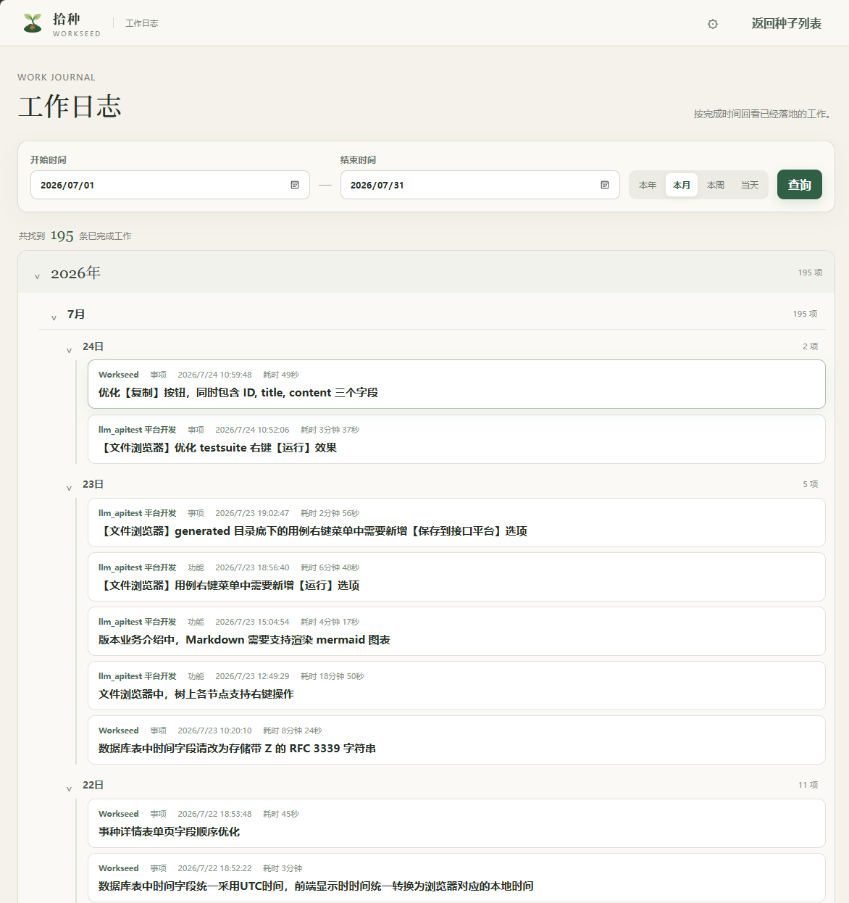

# 拾种 Workseed

拾种（Workseed）是一款面向个人的轻量工作记录工具，用来捕捉突然出现的待办、需求、缺陷和灵感，并把整理、推进与复盘串成一条清晰的工作轨迹。

## 项目背景与定位

在使用 Workseed 之前，这些零散念头通常散落在记事本和各个项目的 `todo.md` 中。纯文本足够轻便，但内容不断积累后，查找、分类、排序和回顾都会变得困难。

Workseed 保留了随手记录的轻便，同时用项目、类型、状态和优先级帮助个人整理工作。它专注于个人使用，不提供团队权限、任务指派或完整的项目管理能力；需要团队协作时，应选择专业的项目管理工具。

### 使用前：零散的纯文本

待办事项和灵感混在一起，记录简单，但内容增多后难以浏览和查找。

### 使用后：清晰的工作视图

所有事种按项目集中管理，可以快速筛选当前工作，也可以随时回顾历史记录。

## 功能

- 随手记录待办、需求、缺陷和灵感，不再担心重要念头转瞬即逝
- 按项目集中整理零散事项，同时获得跨项目的全局视角
- 使用类型、状态、优先级和关键字快速找到当前最值得处理的工作
- 清楚掌握每条事种从待实现、进行中到完成或跳过的处理进展
- 归档暂时不再关注的项目，让当前工作空间始终保持清晰
- 自动记录开始时间、完成时间和有效工作耗时，并生成工作日志
- 按年、月、日回顾已经完成的工作，持续积累可检索、可复盘的个人工作轨迹

## 与 Agent 一起工作

Workseed 可以连接本地 Agent，把记录下来的需求直接转化为可执行的开发任务。既可以处理一条明确的事种，也可以按优先级持续推进整个项目。

Agent 可以完成代码实现、测试、验证和提交，Workseed 则持续记录处理进度、工作耗时和最终结果。两者配合可以减少重复沟通和手工跟踪，让零散需求更稳定地转化为可验证、可追踪的交付成果。

## 自动生成工作日志

工作日志不需要单独填写，它由事种状态的变化自动生成。无论是在界面中手动更新状态，还是由 Agent 通过 MCP 处理事种，Workseed 都使用同一套时间记录规则：

- 事种进入“进行中”时记录开始时间。
- 事种进入“已完成”时记录完成时间。
- 已有开始时间时，根据设置页配置的上下班时间计算有效工作耗时；非工作时间不会计入。
- 事种进入“已暂停”或“已跳过”时不会出现在已完成工作日志中。

点击页面左上角的 Workseed Logo 即可进入工作日志。日志支持按本年、本月、本周、当天或自定义日期范围查询，并按年、月、日分级展示所有项目中已完成的工作。

当 Agent 使用 `workseed-auto-work` 领取并完成事种时，“开始处理 → 完成提交 → 写入日志”会自然连成一个流程。这样既不增加额外记录负担，又能在日后按时间回顾完成内容、实际投入和项目进展，让零散的开发工作沉淀为可检索的工作轨迹。

## 字段约定

### 类型

| 中文 | 英文值 | 用途 |
| --- | --- | --- |
| 灵感 | `idea` | 尚未确定是否实施的想法 |
| 功能 | `feature` | 明确的功能需求或改进 |
| 事项 | `todo` | 需要处理的具体工作，默认值 |
| 缺陷 | `bug` | 需要修复的问题 |

### 状态

| 中文 | 英文值 | 说明 |
| --- | --- | --- |
| 待实现 | `inbox` | 尚未完成，默认值 |
| 进行中 | `doing` | 进入该状态时记录开始时间 |
| 已暂停 | `paused` | 暂停处理，可稍后重新调整状态继续 |
| 已跳过 | `skipped` | 当前条件不完整或不再处理 |
| 已完成 | `done` | 进入该状态时记录完成时间；有开始时间时同时计算耗时 |

状态之间没有强制流转关系，可以从“待实现”直接改为“已完成”，也可以依次经过“进行中”和“已暂停”。进入“已暂停”或“已跳过”会清除完成时间与耗时；未记录开始时间时，完成后的耗时保持为空。耗时只累计设置中工作时间范围内的秒数，默认工作时间为每天 10:00–19:00。

### 优先级

| 中文 | 英文值 |
| --- | --- |
| 高 | `high` |
| 中 | `middle` |
| 低 | `low` |

## 运行

下载对应系统的发布包并解压，直接运行 `workseed`（Windows 下为 `workseed.exe`）。程序会自动选择可用端口并打开浏览器，数据保存在程序启动目录的 `./data` 中。

Workseed 只监听本机地址，同一用户会话中只允许运行一个实例。重复启动会直接退出。

## 使用建议

- 标题写结论或动作，详细内容记录背景、约束和验收方式。
- 尚不明确的念头使用“灵感”，明确要做的工作再调整为“功能”或“事项”。
- 暂时不处理的事种可以降低优先级或设为“已暂停”，确认不再需要后再删除或跳过。
- 定期回顾已完成工作和长期未处理的事种，让 Workseed 始终反映真实的工作重点。

## 开发文档

项目采用 Go、Vue 3、TypeScript、Vite 和 SQLite。前端构建产物会嵌入 Go 二进制，发布时只需要一个可执行文件和一个数据目录。

本地开发、生产构建、多平台发布、数据备份和 API 说明请参阅[开发指南](docs/development.md)。本项目由 Codex 完成。
